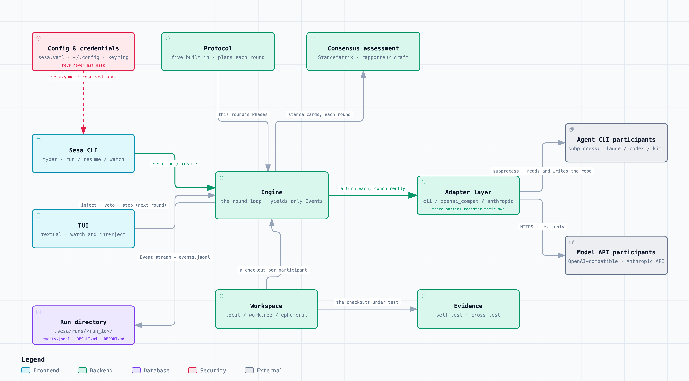

# Sesa

> **English** · [中文](README.zh.md)

**A multi-agent deliberation engine.** Bring the agent CLIs and model APIs you already have to
one table, have them argue under a chosen protocol, and get back a decision **plus an honest
account of what they did not settle** — rather than a synthesised paragraph that hides the
disagreement.

**It orchestrates disagreement, not tasks.** The participants are agents you already use —
claude code, codex, Kimi CLI — not sub-agents defined inside the framework. Adding one is a few
lines of YAML, not Python.

[](LICENSE)


```
           a                      b                     c
       agent CLI              agent CLI             API model
    (tools, reads files)   (tools, reads files)     (text only)
            └──────────────────┼──────────────────┘
                             sesa
                               │
              ┌────────────────┴────────────────┐
          RESULT.md                     disagreement matrix
    conclusion / grounds                who disagrees with whom
    open items / minority views              and on what
```

## What you get

While it runs, the disagreement between the parties is a table you can read:

```
   a       b       c
a  —       oppose  agree
b  oppose  —       partly
c  agree   oppose  —

3 cells hold explicit opposition · lowest confidence 0.75
```

When it finishes, `.sesa/runs/<run_id>/` holds:

```
RESULT.md      the deliverable. Constant skeleton:
               Conclusion / Grounds / Open disagreements / Minority opinions
RESULT.json    the same thing structured, for other tools to consume
REPORT.md      the minutes: how the matrix evolved, and what it cost
events.jsonl   the raw event stream — replayable, evaluable, the only source of truth
turns/         everyone's raw text, per round
```

And every open disagreement comes with a way out, not just two contradictory essays.
An excerpt of `RESULT.md`:

> **Disagreement 1: the assumed deployment scale**
>
> | Participant | Position | Reason |
> |---|---|---|
> | a | a single Postgres is enough | lower running cost at the current volume |
> | b | sharding is required | it hits a wall on the three-year growth curve |
>
> **Root cause**: the two assume different peak QPS (a ~500, b ~50000)
>
> **What would settle it**: what is your actual peak QPS?
>
> **Next**: `sesa resume <run_id> --inject "peak QPS is about 3000"`

Exit codes make it usable from CI: **0** full consensus, **3** consensus with reservations,
**2** not reached, **4** this protocol does not measure consensus.

## Quick start

> This is not yet published to PyPI, so install from source. Once released this becomes
> `uv tool install sesa`.

```bash
git clone https://github.com/goldenxingxing/sesa && cd sesa
uv pip install .            # or: pip install .

sesa init     # detect installed agent CLIs, configure API models, keys into the system keyring
sesa doctor   # confirm every participant can actually be called
sesa run "Postgres or SQLite?"
```

`sesa init` finds the agent CLIs already on your machine (`claude`, `kimi`, …) and lists them.
An API model needs a key, and the wizard puts it in the system keyring, **writing it to no
file**. Two participants are enough — two CLIs, two API models, or one of each.

You do not have to wait for a run to finish:

```bash
sesa run --tui "your topic"                 # full screen: watch everyone write, interject
sesa watch                                  # follow the latest run; Ctrl-C leaves it running
sesa resume <run_id> --inject "extra info"  # carry on from where it stopped
```

**Many problems only appear in the middle** — a round timing out, one participant failing every
round, evidence red throughout — and none of it need leave a trace in the outcome. In one
measured run whose outcome was `exhausted`, the middle held "one participant timed out after
900 seconds in round 0, and its evidence was red for two rounds", none of which is visible
anywhere in `RESULT.md`.

The TUI offers four interventions, all recorded as replayable events:

| Key | Intervention | When it takes effect |
|---|---|---|
| `i` | Interject — append a constraint | **the next round**; the round being written cannot see it |
| `v` | Veto a premise — declare one invalid | the next round |
| `f` | Follow one side | the next round |
| `s` | Wrap up early | this round finishes first — **it is not cut off mid-way** |

More:

```bash
sesa run --file rfc.md "review this RFC" --protocol adversarial
sesa run "topic" -p claude -p kimi --rounds 6
sesa run "topic" --json | jq 'select(.t=="consensus.update")'

# A code task: an isolated git worktree each, really editing code and running tests.
# With --tests, the final round cross-tests: A's tests against B's implementation.
sesa run --repo . --verify "pytest -q" --tests tests/ "fix issue #123"

# The control baseline: same people, same rounds, but nobody sees anybody.
# Only change beyond this baseline can be attributed to the debate.
sesa run "the same topic" --protocol reflect
```

**The participants work in the directory you typed the command in** — when the task says "the
documents in this folder", they really can see them. Add `--repo` for isolation: a git worktree
each, branches kept.

## The core idea

```
Participant = Adapter (how to call it, and what it can therefore do)
            × Model  (which brain)
            × Role   (what stance)
```

**The adapter decides what a participant can do, not merely how you reach it.** The same model
through two adapters is two different participants:

```yaml
- id: claude-agent      # through the CLI: reads the code first, runs the tests, then speaks
  adapter: cli
  command: ["claude", "-p"]

- id: claude-api        # the same model through the API: plain text reasoning, no tools
  adapter: anthropic
  model: claude-sonnet-5
```

| | one model through `cli` | the same model through an API adapter |
|---|---|---|
| Its own agent loop | yes, it can iterate | no, one question one answer |
| Read files / grep the codebase | **yes** — it reads the code before speaking | **no** — only the text you put in the prompt |
| Run tests, see exit codes | yes | no |
| Write files | writes them itself | the engine writes for it (`patch.apply_files`) |
| Billing | a subscription; no token counts, so the budget falls back to the wall clock | per token, with real usage |

One brain; one of them **can go and look** and the other **can only infer**. When they say
"`src/db.py` already uses JSONB", the first went and read it and the second is guessing — and
that is the line between a disagreement worth having and one that is not.

> We learned this the hard way. A model reached through the API cannot write files, and the engine grew
> "extract code blocks and write them out" for it. **The other half — that it cannot *read*
> files either — was missed**: all it received was one sentence, "implement what SPEC.md in the
> repository says", and the spec itself never entered its context. It wrote
> `# NOTE: This parser intentionally does NOT support ^, ~, x, or hyphen ranges.`
> That reads like a judgement, and it was a missing input. A whole round of experiments was
> voided (DESIGN 14.17).

| Adapter | How it calls | Covers |
|---|---|---|
| `cli` | spawns a subprocess, streams stdout | claude code / codex / dsh / gemini-cli / aider / cursor-agent … **adding one takes no code** |
| `openai_compat` | OpenAI Chat Completions | DeepSeek / Kimi / OpenRouter / Ollama / vLLM / Groq / Together |
| `anthropic` | Anthropic Messages | Claude API |

## How it differs from AutoGen / CrewAI / agent orchestrators

| | Those | sesa |
|---|---|---|
| What is orchestrated | tasks, dispatched supervisor→worker | **disagreement** — its production and its resolution |
| What a participant is | an object defined inside the framework; a different `llm_config` counts as a different one | **a complete external agent**, with its own agent loop, tool stack and file access |
| Where its abilities come from | you register tools for it, in the framework | **it brings them itself** — sesa neither owns it nor defines what it can do |
| Adding a participant | write Python | write YAML |
| How agreement is decided | a fixed round count, or an agent saying "TERMINATE" | **a computable disagreement matrix** plus stability detection — agreement is computed, not declared |
| The output | a synthesised paragraph | a decision + the disagreements + minority opinions + an outcome label |
| The referee | usually one of the contestants | **none**: consensus is the deliverable; otherwise a person decides |
| Code tasks | rests on a model saying "I tested it" | worktree isolation + results **the engine ran itself**, plus cross-testing |

The existing agent-CLI orchestrators (AWS `cli-agent-orchestrator`, Conductor, Agent Teams) are
all supervisor→worker task dispatch. What Sesa orchestrates is **the production and resolution
of disagreement**, not the splitting of a task.

## Four design bottom lines

1. **No referee.** When consensus is reached, the consensus is the deliverable; when it is not,
   the positions are set out side by side with the matrix, and a person decides.
2. **Not confirmed to agree ≠ agreed.** The assessment is default-deny: only a parseable,
   explicit `agree` resolves a cell. And "someone objected" is accounted separately from "the
   engine did not measure it" — compressing the two is labelling missing data as disagreement.
3. **Stuck ≠ united.** Six grades of outcome; `deadlock` and `exhausted` are never written up as
   consensus. **And agreeing is not agreeing on the right thing**: if someone throws away their
   own implementation for a rival's and their self-tests go from passing to failing, full
   consensus is downgraded and `RESULT.md` says so *before* the conclusion.
4. **A conclusion is delivered with its premises.** Most disagreements come from differing
   premises rather than a wrong conclusion, so premises are a field of their own — pulled out
   **so they can be overturned**, with `resume --inject` to do it.

## We used it to review itself

`examples/self-review/` is a reusable configuration: it has Sesa hold a deliberation over its own
source, on the topic **"the things the README promises — does the code actually do them?"**

Every defect found is in `tests/test_bottom_lines*.py` and `tests/test_fix_review_*.py` — **the
test names are the list of findings**, and no number that could go stale is written here. All
were verified mechanically, all have regression tests, and **not one was found by the author's
own review**. Among them:

- `sesa run` crashing for certain in a real terminal — that path runs only under a TTY, and every
  test and manual check at the time ran without one, so it had never been executed
- rewording a residual made deadlock detection never fire — a comment said plainly "a self-report
  is not enough to reset the counter", and the function called on the next line called residuals,
  which are self-reported text, an "objective signal"
- both sides agreeing without reservation judged `exhausted`, while both giving only a partial
  with residuals was judged "consensus with reservations" — a weaker agreement buying a better
  outcome

It is also this project's only test that runs a whole deliberation for real. Usage and three
traps to watch for are in [examples/self-review/README.md](examples/self-review/README.md).

## Architecture



Every node carries the source files it was read from.

## Documentation

- [DESIGN.md](DESIGN.md) — the architecture, and the full evidence ledger including everything
  that was overturned or withdrawn
- [CONTRIBUTING.md](CONTRIBUTING.md) — what this project is picky about, and why
- [CHANGELOG.md](CHANGELOG.md)
- [sesa.example.yaml](sesa.example.yaml) — every setting, with the measurement behind it

## Development

```bash
uv venv && uv pip install -e ".[dev,keyring]"
uv run pytest
uv run ruff check src tests && uv run ruff format --check src tests
```

## License

MIT
