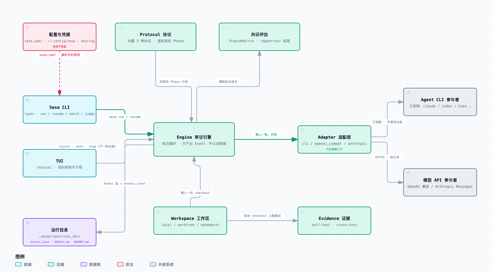

# Sesa

> [English](README.md) · **中文**

**多 Agent 议事引擎。** 把你手上已有的 agent CLI 和模型 API 拉到同一张桌子上，按可选的
议事协议辩论，最后拿到一份结论，**外加一份如实的「哪些没谈拢」**——而不是一段把分歧
藏起来的合成文字。

**它编排的是分歧，不是任务。** 参与者是你已经在用的那些 agent——claude code、codex、
Kimi CLI——不是框架内新造的子 agent。加一个是几行 YAML，不是一段 Python。

[](LICENSE)


```
           a                      b                     c
       agent CLI              agent CLI            API 模型
     （有工具、读文件）      （有工具、读文件）      （纯文本）
            └──────────────────┼──────────────────┘
                             sesa
                               │
              ┌────────────────┴────────────────┐
          RESULT.md                        分歧矩阵
      结论 / 共识依据                   谁和谁在哪一点上
      未决分歧 / 少数意见                  还没谈拢
```

## 你会拿到什么

跑的过程中，各方的分歧是一张能读的表：

```
   a       b       c
a  —       反对    同意
b  反对    —       部分
c  同意    反对    —

3 处有人明确反对 · 最低置信度 0.75
```

跑完之后，`.sesa/runs/<run_id>/` 下是：

```
RESULT.md      主产出。骨架恒定：结论 / 共识依据 / 未决分歧 / 少数意见
RESULT.json    同一份的结构化版本，供别的工具消费
REPORT.md      议事纪要：分歧矩阵怎么演变的、花了多少
events.jsonl   原始事件流——可回放、可评测，也是唯一的真相来源
turns/         每人每轮原文
```

而且每条未决分歧都带着出路，不是把两份互相矛盾的长文丢回给你。
`RESULT.md` 里的一段：

> **分歧 1：部署规模的前提假设**
>
> | 参与者 | 立场 | 理由 |
> |---|---|---|
> | a | 单机 Postgres 足够 | 现有量级下运维成本更低 |
> | b | 必须上分片 | 按三年增长曲线会撞墙 |
>
> **根因**：双方对峰值 QPS 的假设不同（a 假定 ~500，b 假定 ~50000）
>
> **决断所需信息**：你们实际的峰值 QPS 量级？
>
> **下一步**：`sesa resume <run_id> --inject "峰值 QPS 约 3000"`

退出码可以直接接进 CI：**0** 完全共识，**3** 有保留的共识，**2** 未达成，
**4** 本协议不测量共识。

## 快速开始

> 尚未发布到 PyPI，所以先从源码装。发布后这里会换成 `uv tool install sesa`。

```bash
git clone https://github.com/goldenxingxing/sesa && cd sesa
uv pip install .            # 或 pip install .

sesa init     # 探测已装的 agent CLI，配置 API 模型，凭据存进系统钥匙串
sesa doctor   # 确认每个参与者都能调通
sesa run "该用 Postgres 还是 SQLite？"
```

`sesa init` 会自己去找你机器上已装的 agent CLI（`claude`、`kimi`……）并列出来。
API 模型需要一个 key，向导会把它存进系统钥匙串，**不写进任何文件**。
两个参与者就能开一场——两个 CLI、两个 API 模型，或者一边一个。

一场议事跑起来之后不必干等：

```bash
sesa run --tui "你的议题"                    # 全屏观战：并排看各方在写，随时插话
sesa watch                                   # 跟最新一场，Ctrl-C 退出（不影响那场议事）
sesa resume <run_id> --inject "补充的信息"   # 从断点接着辩
```

**很多问题只出现在中间**——某一轮超时、某个参与者每轮都失败、证据一直是红的——
而这些在终局里可能一点痕迹都没有。实测中一场终局为 `exhausted` 的议事，
过程里其实是「一位参与者第 0 轮超时 900 秒、两轮证据全红」，
而 `RESULT.md` 上一个字都看不到。

TUI 里有四种干预，都落成可回放的事件：

| 键 | 干预 | 什么时候生效 |
|---|---|---|
| `i` | 插话——追加一条约束 | **下一轮**，正在写的那一轮拿不到 |
| `v` | 否决前提——宣告某条前提无效 | 下一轮 |
| `f` | 跟随某方 | 下一轮 |
| `s` | 提前收束 | 当前这一轮先跑完——**不拦腰砍断** |

更多用法：

```bash
sesa run --file rfc.md "评审这份 RFC" --protocol adversarial
sesa run "议题" -p claude -p kimi --rounds 6
sesa run "议题" --json | jq 'select(.t=="consensus.update")'

# 代码任务：每人一个隔离的 git worktree，真改代码、真跑测试。
# 给了 --tests，末轮做交叉测试：拿 A 的测试跑 B 的实现。
sesa run --repo . --verify "pytest -q" --tests tests/ "修复 issue #123"

# 对照基线：同样的人、同样的轮数，但互不可见。
# 只有超出这条基线的变化，才能归因于辩论。
sesa run "同一议题" --protocol reflect
```

**参与者就在你敲命令的那个目录里工作**——任务里说「这个文件夹下的文档」时，
它们真的看得到。要各自隔离就加 `--repo`：每人一个 git worktree，分支保留。

## 核心概念

```
Participant = Adapter（怎么调它，以及它因此能做什么）
            × Model （哪个脑子）
            × Role  （什么立场）
```

**adapter 决定这个参与者能做什么，不只是怎么调它。** 同一个模型走两个 adapter，
就是两个不同的参与者：

```yaml
- id: claude-agent      # 走 CLI：先翻代码、跑测试，然后才发言
  adapter: cli
  command: ["claude", "-p"]

- id: claude-api        # 同一个模型走 API：纯文本推理，无工具
  adapter: anthropic
  model: claude-sonnet-5
```

| | 一个模型走 `cli` | 同一个模型走 API 适配器 |
|---|---|---|
| 自己的 agent 循环 | 有，能多步试错 | 无，一问一答 |
| 读文件 / grep 代码库 | **能**，会先翻代码再发言 | **不能**，只看得到你塞进提示词的字 |
| 跑测试、看退出码 | 能 | 不能 |
| 写文件 | 自己写 | 引擎代它落盘（`patch.apply_files`） |
| 计费 | 订阅制，拿不到 token 数，预算靠墙钟兜底 | 按 token，有真实用量 |

同一个脑子，一个**能去查**，一个**只能推**。它们说「`src/db.py` 已经在用 JSONB」时，
前者是去看过了，后者是猜的——而这正是分歧值不值钱的分界。

> 这一条是栽出来的。走 API 的模型写不了文件，引擎为此加了「从文本提取代码块并落盘」。
> **而「读不了文件」这另一半漏了**：交给它的只有一句「按仓库里的 SPEC.md 实现」，
> SPEC 本身从没进上下文。于是它写下
> `# NOTE: This parser intentionally does NOT support ^, ~, x, or hyphen ranges.`
> ——那读起来像一个判断，实际是缺失的输入。那一整轮实验作废（DESIGN 14.17）。

| Adapter | 调用方式 | 覆盖 |
|---|---|---|
| `cli` | 起子进程，流式读 stdout | claude code / codex / dsh / gemini-cli / aider / cursor-agent……**加新的不用改代码** |
| `openai_compat` | OpenAI Chat Completions | DeepSeek / Kimi / OpenRouter / Ollama / vLLM / Groq / Together |
| `anthropic` | Anthropic Messages | Claude API |

## 与 AutoGen / CrewAI / agent 编排器的区别

| | 那些 | sesa |
|---|---|---|
| 编排对象 | 任务，按「主管 → 工人」分派 | **分歧**——它的产生与消解 |
| 参与者是什么 | 框架内定义的对象，换个 `llm_config` 就算换了一个 | **外部的完整 agent**，自带 agent 循环、工具栈、文件读写 |
| 它的能力从哪来 | 你在框架里给它注册工具 | **它自己带来的**——sesa 不拥有它，也不替它定义能力 |
| 加一个参与者 | 写 Python | 写 YAML |
| 共识怎么定 | 固定轮数，或 agent 自己说 "TERMINATE" | **可计算的分歧矩阵** + 稳定性检测——共识是算出来的，不是宣布的 |
| 最终产出 | 一段合成文本 | 裁决 + 分歧清单 + 少数意见 + 终局标签 |
| 裁判 | 通常是参赛者之一 | **不设**：共识本身即产出，未达成则交人拍板 |
| 代码任务 | 靠模型自述"我测过了" | worktree 隔离 + **引擎亲自执行**的结果，且有交叉测试 |

现有的 agent CLI 编排器（AWS `cli-agent-orchestrator`、Conductor、Agent Teams）
全部是「主管 → 工人」的任务分派。Sesa 编排的是**分歧的产生与消解**，不是任务的拆分。

## 四条设计底线

1. **不设裁判。** 达成共识时共识本身就是产出；没达成时如实并列各方立场 + 分歧矩阵，
   由人拍板。
2. **没确认到同意 ≠ 同意。** 判定采用 default-deny：只有可解析的显式 `agree` 才算一格
   已解决。而"有人反对"与"引擎没测到"分开记账——压进同一个数字，就是给数据缺失贴
   分歧的标签。
3. **卡死 ≠ 统一。** 终局分六档，`deadlock` / `exhausted` 绝不写成共识。
   **而且一致 ≠ 一致得对**：有人扔掉自己的实现改用对手的、自测因此由通过转失败时，
   完全共识会被降级，`RESULT.md` 在结论**之前**就告诉你。
4. **结论要连着前提一起交付。** 多数分歧源于前提不同而非结论对错，所以前提是独立字段
   ——**拎出来就是为了能被推翻**，`resume --inject` 就是干这个的。

## 我们用它审了它自己

`examples/self-review/` 是一套可复用的配置：让 Sesa 对自己的源码开一场议事，
议题是**「README 里承诺的那几条，代码真的做到了吗」**。

找出的每一条缺陷都留在 `tests/test_bottom_lines*.py` 与 `tests/test_fix_review_*.py` 里
——**测试名就是发现清单**，这里不写一个会过期的数字。全部经机械核验、全部有回归测试，
**无一是作者自查发现的**。其中包括：

- `sesa run` 在真实终端里必崩——该路径只在 TTY 下走，而当时全部测试与手工验证
  都在非 TTY 下，一次都没执行过它
- 残差换个措辞就能让僵局检测永不触发——代码注释明写「自述不足以清零计数器」，
  紧接着调用的函数却把同样是自述文本的残差称作「客观信号」
- 双方**无保留同意**判成 `exhausted`，双方只给**带残差的 partial** 反而判成
  「有保留的共识」——更弱的一致换来了更好的终局

它同时是本项目**唯一覆盖「真跑一整场」的测试**。用法与三个必须注意的坑见
[examples/self-review/README.zh.md](examples/self-review/README.zh.md)。

## 架构



图上每个节点都标着它读自哪些源文件。

## 文档

- [DESIGN.zh.md](DESIGN.zh.md) —— 架构，以及完整的证据台账（含所有被推翻与撤回的论断）
- [CONTRIBUTING.md](CONTRIBUTING.md) —— 这个项目在较什么真，以及为什么
- [CHANGELOG.md](CHANGELOG.md)
- [sesa.example.yaml](sesa.example.yaml) —— 每一项配置，以及它背后的实测数据

## 开发

```bash
uv venv && uv pip install -e ".[dev,keyring]"
uv run pytest
uv run ruff check src tests && uv run ruff format --check src tests
```

## License

MIT
